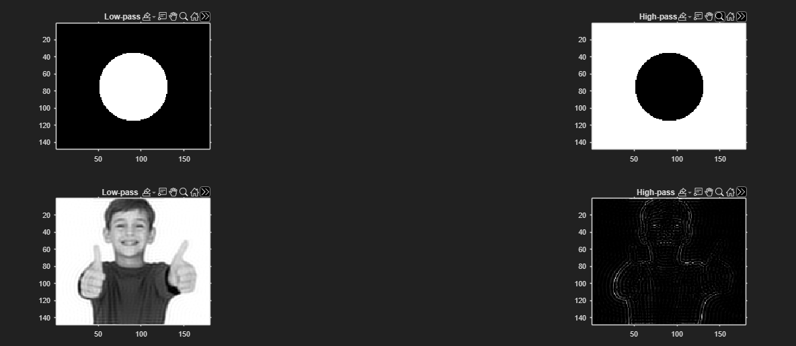
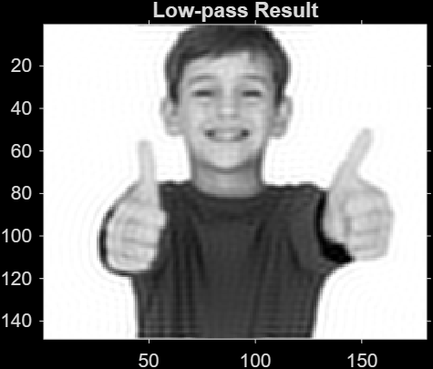
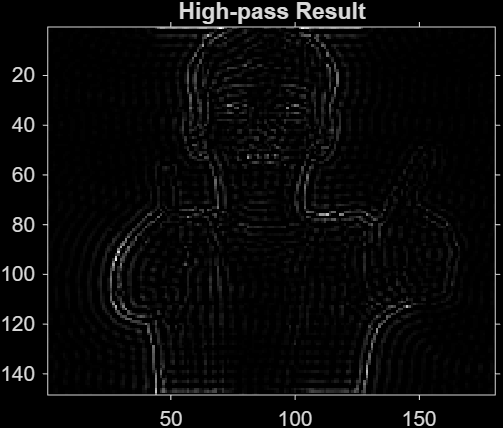

# Fourier-Based Image Processing using MATLAB
Frequency-domain image processing using Fourier Transform in MATLAB.

## Overview
This project demonstrates image processing techniques in the frequency domain using the Fourier Transform in MATLAB.

The project applies FFT-based filtering to analyze image frequencies, visualize the Fourier spectrum, and reconstruct filtered images using low-pass and high-pass filters.

---

## Features
- 2D Fast Fourier Transform (FFT)
- Frequency spectrum visualization
- Frequency shift using FFTShift
- Low-pass filtering
- High-pass filtering
- Image reconstruction using inverse FFT
- Frequency-domain image analysis

---

## Technologies Used
- MATLAB
- Image Processing
- Signal Processing
- Fourier Transform
- Frequency-Domain Filtering

---

## Project Structure

```txt
Fourier-Image-Processing/
│
├── README.md
├── fft_project.m
│
├── images/
│   ├── original/
│   │   └── kid.png
│   │
│   └── results/
│       ├── overview.png
│       ├── spectrum.png
│       ├── lowpass.png
│       └── highpass.png
│
├── docs/
│   └── report.pdf
│
└── LICENSE
```

---

## Processing Pipeline

### 1. Load Image
The input image is loaded and converted into grayscale format for frequency-domain processing.

### 2. Fourier Transform
The image is transformed from the spatial domain into the frequency domain using:

```matlab
fft2()
```

### 3. Frequency Shift
Low-frequency components are shifted to the center using:

```matlab
fftshift()
```

### 4. Frequency Filtering
Circular masks are used to separate:
- Low-frequency components
- High-frequency components

### 5. Image Reconstruction
The filtered frequencies are transformed back into spatial-domain images using:

```matlab
ifft2()
```

---

## Results

### Original Image


### Fourier Processing Overview


### Low-pass Filter Result


### High-pass Filter Result


---

## Concepts Demonstrated
- Fourier Transform
- Frequency-Domain Processing
- FFT & IFFT
- Image Reconstruction
- Image Enhancement
- Edge Extraction
- Signal Analysis

---

## Future Improvements
- Interactive GUI
- Adjustable filter radius
- Gaussian filtering
- Noise reduction techniques
- Multiple image support
- Real-time processing visualization

---

## Author
Developed as a Math III / Image Processing project using MATLAB.

---

## License
This project is licensed under the MIT License.
